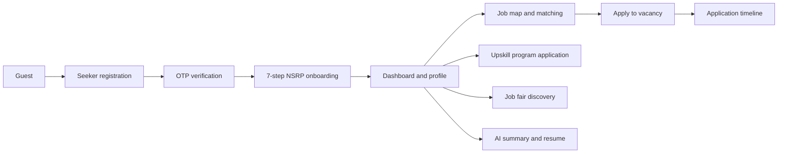
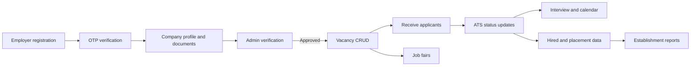
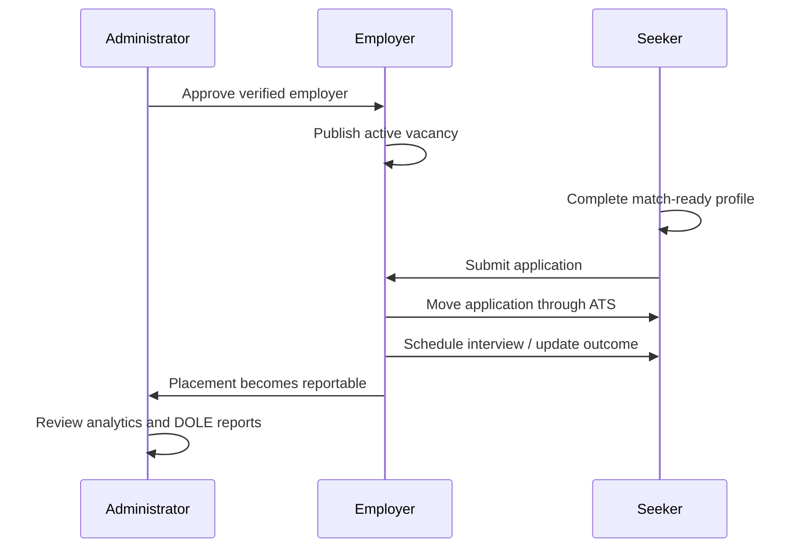

# i-PESO System Review, Flow Map, and QA Master Plan

**Audit date:** July 8, 2026  
**Audited surfaces:** Laravel API, React web portal, Expo seeker app, MySQL-oriented schema, automated tests  
**Primary roles:** Guest, Job Seeker, Employer, Administrator

## 1. Executive verdict

The system has a **strong backend and frontend foundation for its core employment workflow**. Authentication, role boundaries, seeker profile data, employer verification, vacancy posting, applications, ATS movement, job matching, programs, job fairs, reporting, notifications, private files, and analytics have real Laravel endpoints and domain models. This is substantially stronger than a presentation-only capstone.

The system is **not yet release-clean as a whole**. Several administrator menu screens are UI shells without persistence, frontend lint currently fails, the Expo app has a missing-module/type-resolution failure, and one resume-generation backend test is failing after professional summary became required.

### Current maturity rating

| Area | Rating | Evidence and meaning |
|---|---|---|
| Backend architecture | Strong | Laravel 12, Sanctum, role middleware, controllers, services, models, migrations, private-file authorization |
| Core seeker workflow | Strong, regression-sensitive | Seven onboarding endpoints, profile, occupations, skills, certificates, AI summary, resume, maps, applications |
| Core employer workflow | Strong, regression-sensitive | Registration, document review, approval gate, vacancies, ATS, calendar, job fairs, reports |
| Core admin operations | Moderate to strong | CRM, verification, programs, job fairs, analytics, reports and logs are backend-backed |
| Admin configuration and Smart Match screens | Incomplete | Several screens explicitly state that backend integration is pending |
| Web production build | Pass | Vite production build completed successfully |
| Web static quality gate | Fail | ESLint: 82 errors and 9 warnings; includes a runtime-risk undefined ATS function |
| Backend automated verification | Strong with one regression | 145 passed, 1 failed, 1,463 assertions across non-example suites |
| Mobile quality gate | Fail | Expo lint: 1 error, 3 warnings; TypeScript cannot resolve `@expo-google-fonts/dm-sans` |

## 2. Verification performed during this audit

### Passed

- React/Vite production build: passed, 2,999 modules transformed.
- Backend focused suites: 145 tests passed with 1,463 assertions.
- Verified domains include registration, hiring flow, employer verification, job posting, seeker profile, occupation and skill taxonomy, job matching, SMS, government programs, job fairs, establishment reports, admin analytics, directories, and Google Maps normalization.

### Failed or requiring action

1. `SeekerProfileFeaturesTest::test_seeker_can_generate_a_resume_from_nsrp_data`
   - Expected HTTP 200 PDF response; received HTTP 302.
   - Response says `professional summary field is required`.
   - The resume contract and test fixture are out of sync.

2. Web ESLint
   - 82 errors and 9 warnings.
   - Important functional risk: `EmployerATSGrid.jsx` references `updateEmployerApplicationStatus` without defining/importing it.
   - Other findings include unused state, React effect warnings, Fast Refresh structure findings, and hook dependency warnings.

3. Mobile lint and TypeScript
   - `app/_layout.tsx` cannot resolve `@expo-google-fonts/dm-sans` even though it is declared in `package.json`.
   - Three unused-variable warnings also remain.

## 3. Foundation assessment by module

### A. Backend-backed and suitable for full QA

| Role | Module | Main contract |
|---|---|---|
| All | Authentication | Register, OTP, login, resend, forgot/reset password, session restore, logout |
| Seeker | NSRP onboarding | Seven step-specific save endpoints with conditional validation |
| Seeker | Profile and credentials | Profile read/update, photo, private certificates, AI summary, PDF resume |
| Seeker | Employment discovery | Dashboard summary, map feed/detail, nearby jobs, saved jobs, matching |
| Seeker | Applications | Apply, list/detail, timeline, withdraw, notifications |
| Seeker | Upskill Hub | Programs, recommendations, eligibility, application documents |
| Employer | Registration and verification | Company profile, documents, representative, admin review and approval |
| Employer | Recruitment | Vacancy CRUD, ATS list/detail/status/bulk status, interviews, calendar |
| Employer | Job fair ecosystem | Interest, invitations, requirements, confirmation, results and ROI Form 3 |
| Employer/Admin | Establishment report | Preview, employer isolation, filters, PDF and CSV export |
| Admin | Constituent CRM | Seeker/employer directories, summaries, detail, NSRP PDF |
| Admin | Programs and job fairs | CRUD, publication, invitation, applicant review, exports |
| Admin | Analytics and operations | Dashboard, labor analytics, location quality, SMS log, activity log, SPRS reports |

### B. Partially complete or higher-risk

| Module | Current state | QA implication |
|---|---|---|
| Admin Job Postings | Route exists, page is only a read-only information card | Do not count as a vacancy monitoring feature yet |
| Admin Smart Matches | UI explicitly says backend matching run history is not implemented | Treat button as known incomplete, not a passing feature |
| Admin PEIS Export | Uses hardcoded rows, random record count, timeout, and `#` download | Prototype only; no compliance claim |
| System Settings | Local component state and success message; no API route | Changes are not durable |
| Staff Management | Empty local state and alert placeholders | No staff CRUD backend |
| Roles and Permissions | Empty local state and alert placeholders | Only coarse built-in role guards currently exist |
| Announcements | Empty local state and alert placeholders | No publishing backend |
| Content Modules | Empty local state and alert placeholders | No content-management backend |
| SMS Templates | Read-only hardcoded documentation cards | Sending/logging backend exists; template administration does not |

### C. Existing components/screens not connected to active web routes

- Employer programs and employer upskill-needs pages exist, but are not exposed in the active router.
- Seeker Digital QR Pass exists, but is not exposed in the active router.
- Several older/alternate seeker and admin pages remain in the tree and should be treated as legacy until intentionally routed.

## 4. User and screen inventory

| User | Active screens and responsibilities |
|---|---|
| Guest | Landing, login, registration gateway, seeker registration, employer registration, email/OTP verification, forgot/reset password |
| Seeker Web | Onboarding, dashboard, AI Job Map, job fairs, applications, profile, profile update, Upskill Hub, recommended programs, program details and applications |
| Employer Web | Onboarding, verification dashboard, vacancy posting, vacancy list, ATS, interview calendar, job fairs, establishment report |
| Administrator Web | Dashboard, employer verification, seeker/employer directories, job-posting shell, Smart Match shell, programs, job fairs, DOLE reports, establishment report, PEIS prototype, analytics, location quality, activity logs, SMS logs/templates, configuration shells |
| Seeker Mobile | Registration, login, verification, onboarding handoff, home, jobs, applications, profile |

## 5. End-to-end system flows

### Seeker lifecycle

### Employer lifecycle

### Cross-role employment flow

## 6. QA batch index

| Batch | Scope | Cases | File |
|---|---|---:|---|
| 01 | Authentication, registration, verification, sessions, guards | 32 | `QA_BATCH_01_AUTH_ACCESS_AND_REGISTRATION.md` |
| 02 | Seeker NSRP onboarding, profile update, photo, certificates, AI summary and resume | 42 | `QA_BATCH_02_SEEKER_WEB_PROFILE_AND_MATCHING.md` |
| 03 | Seeker dashboard, job discovery, matching, applications, programs and job fairs | 38 | `QA_BATCH_03_SEEKER_JOBS_APPLICATIONS_PROGRAMS_AND_JOB_FAIRS.md` |
| 04 | Employer registration, documents, verification and access gates | 32 | `QA_BATCH_04_EMPLOYER_REGISTRATION_VERIFICATION_AND_ACCESS.md` |
| 05 | Employer vacancies, ATS, interviews, calendar, job fairs and reports | 40 | `QA_BATCH_05_EMPLOYER_RECRUITMENT_ATS_JOB_FAIRS_AND_REPORTS.md` |
| 06 | Admin dashboard, CRM, verification, analytics and employment hub | 38 | `QA_BATCH_06_ADMIN_CRM_ANALYTICS_AND_EMPLOYMENT_HUB.md` |
| 07 | Government programs, job fairs, DOLE reporting and configuration maturity | 42 | `QA_BATCH_07_GOVERNMENT_PROGRAMS_JOB_FAIRS_DOLE_AND_CONFIGURATION.md` |
| 08 | Mobile, cross-platform, security, privacy, performance, accessibility and recovery | 48 | `QA_BATCH_08_MOBILE_CROSS_PLATFORM_SECURITY_AND_NON_FUNCTIONAL.md` |

**Total planned manual/API cases: 312.**

## 7. Recommended execution order

1. Run Batch 01 first; stop if authentication or role isolation has a Critical defect.
2. Run Batches 02 and 04 to create trustworthy seeker and employer records.
3. Run Batches 03 and 05 to exercise the employment pipeline.
4. Run Batches 06 and 07 using the records created by earlier batches.
5. Run Batch 08 as the final cross-platform and non-functional release gate.

## 8. Release gates

- **Critical:** no authentication bypass, cross-tenant data access, private-file leak, destructive data corruption, or unusable core application flow.
- **High:** no broken registration/onboarding, employer approval, vacancy publication, job application, ATS status, interview, program application, or official report generation.
- **Medium:** no misleading success, stale counts, broken filters, missing data, inaccessible primary controls, or unusable responsive layout.
- All production builds and static quality gates must pass.
- All backend tests must pass, including the current resume-generation regression.
- UI-only prototype modules must be hidden, clearly labeled, or completed before being presented as operational features.

## 9. QA result vocabulary

- `PASS` — expected behavior and persisted data are correct.
- `FAIL` — expected result is wrong or a defect occurs.
- `PARTIAL` — primary action works but data, feedback, layout, or secondary behavior is incomplete.
- `BLOCKED` — test cannot proceed because required environment, credentials, seed data, or upstream service is unavailable.
- `NOT IMPLEMENTED` — audited screen is intentionally a shell/prototype; do not record it as a product pass.
